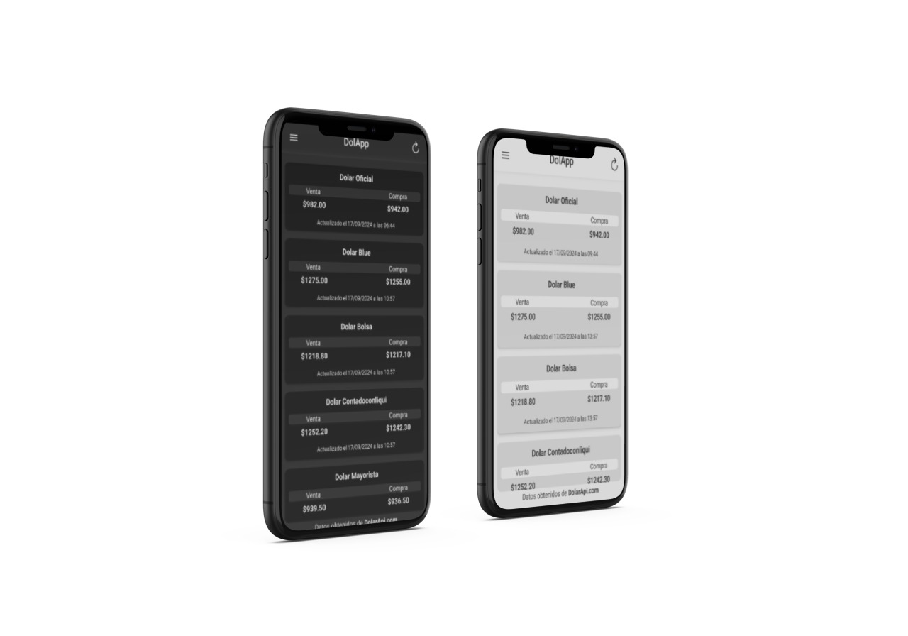
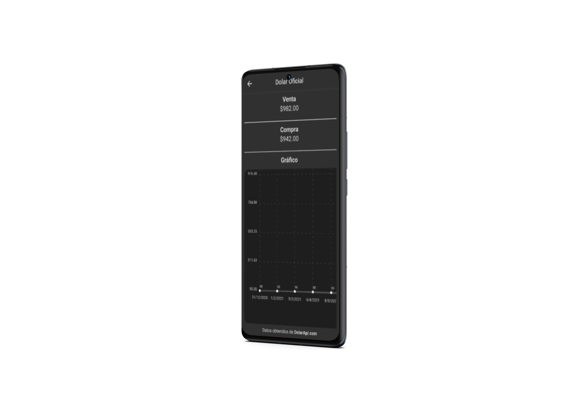
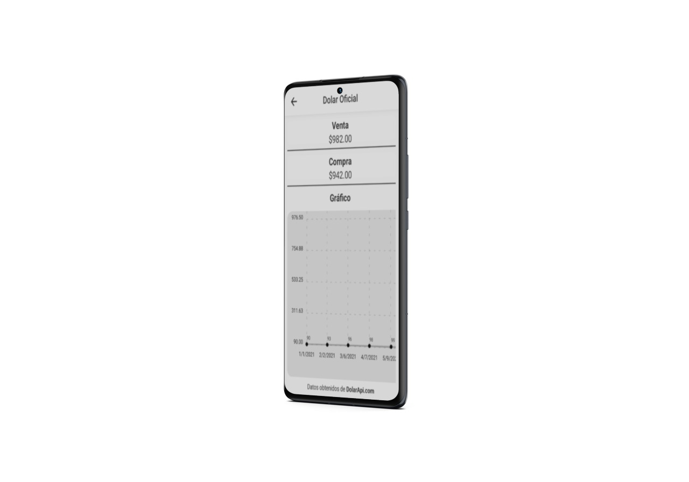

  <h1>💰DolApp💵</h1> 
Esta aplicación, desarrollada con React Native y TypeScript CLI, permite realizar consultas sobre el valor del dólar y consultar su historial de años anteriores a través de gráficos interactivos.   

<b>Caracteristicas:</b>  

  <li>Consulta de Dólar: Ofrece el valor actual del dólar y datos históricos. </li>
  <li>Visualización de Datos: Muestra un gráfico con el historial del dólar a lo largo de los años.</li>
  <li>Navegación: Utiliza React Navigation con una combinación de Drawer y Stack para una experiencia de usuario fluida.</li>
  <li>Tema: Implementa useContext para gestionar el tema de la aplicación, adaptándose automáticamente al tema predefinido del sistema del usuario.</li>
 
  

  
    
  

 
  <b>:abcd:Stack:</b> ReactNative/Typescript. 
  <b>:page_facing_up: Ide:</b> Visual Studio Code.   
  <b>:books: Librerias:</b>  
  <ul><li>Axios: utilizada para hacer consultas a la API. </li>
  <li>TanStackQuery: utilizada para manejar los datos de la consulta de una forma mas optimizada aprovechando el uso del cache.</li>
  <li>React Native Paper: utilizada para hacer uso de sus componentes y navigators.</li>
  <li>React Native Chart-Kit: utilizada para mostrar los datos de años anteriores hasta el actual en un grafico con posibilidad de scroll.</li>
  <li>React Native Vector Icons: utilizada para mostrar iconos.</li>
  </ul>            

  <b>:camera:Imagenes::camera:</b>

  
  
  
  

  <b>📹Videos📹</b>

  [Navegación](https://youtube.com/shorts/SR_zSos2lDs)
  
  [DarkAndLight](https://youtu.be/_hHPemqo3rk)
  
  

  
  
  
  
